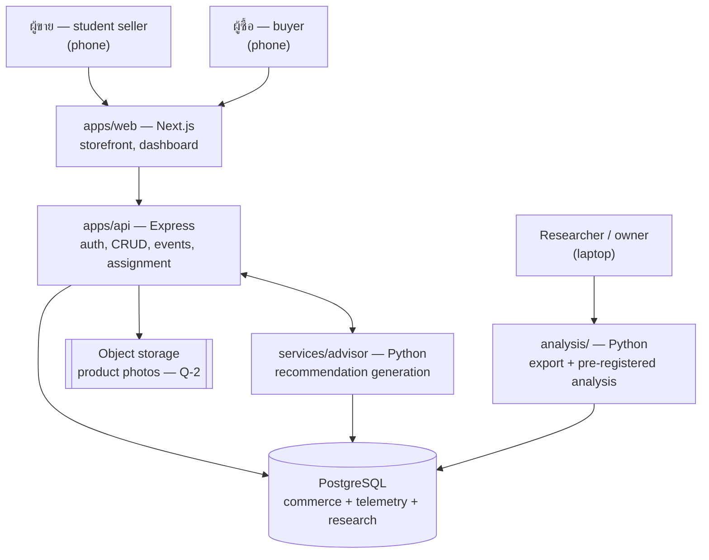
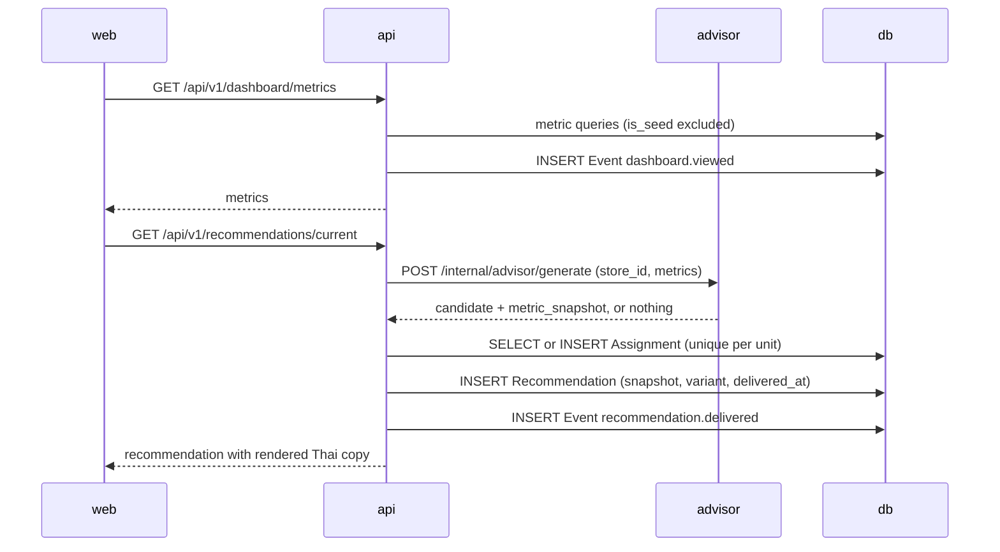

# High-level architecture

**Status:** draft
**Written:** 2026-08-28
**Requirements:** all of `docs/01-requirements/requirements.md`
**Related:** `database-schema.md`, `api-spec.md`, `detailed-design.md`, `decisions/0001-append-only-event-store.md`

The stack is fixed by `CLAUDE.md` and is deliberately boring: Next.js, Express, PostgreSQL via Prisma, Python for the advisor and the analysis. The novel part of this project is the study, not the infrastructure, and every hour spent on architecture is an hour not spent collecting data in a semester that does not repeat.

What follows is therefore mostly about *where things are allowed to happen* rather than about technology. Three placement rules carry almost all of the risk:

1. **Events are written by the API, inside the transaction that performed the action.** Never by the browser.
2. **Assignment happens in the API, once, persisted.** Never in the browser, never recomputed.
3. **Metrics are computed in one place** and read by both the dashboard and the advisor. Two implementations would drift, and the seller would be shown one number while the advisor argued from another.

## Context



Everything a user does passes through `apps/api`. That is the single choke point where an event can be guaranteed, and it is the reason the browser never talks to the database or to the advisor directly.

## Components

| Component | Language | Responsibility | Must not |
|---|---|---|---|
| `apps/web` | TypeScript, Next.js App Router | Rendering, forms, navigation, Thai UI | Randomise anything; write events; compute metrics |
| `apps/api` | TypeScript, Express | Auth, authorisation, CRUD, event emission, assignment, metric layer | Log personal data; emit an event before its write commits |
| `services/advisor` | Python | Trigger rules, snapshot construction, copy rendering | State anything not present in the snapshot |
| `packages/db` | Prisma | Schema, migrations, seed | Update or delete `Event` rows |
| `packages/shared` | TypeScript | Event type constants, DTO types, `action_type` mapping | Hold a second copy of a type defined elsewhere |
| `analysis/` | Python | Export, pre-registered analysis | Invent a query that is not in the analysis plan |

## Why the advisor is a separate service

It could have been a module inside the API, and that would be one less thing to deploy. It is separate for two reasons that are specific to this project:

- The analysis is written in Python and shares the metric definitions. Keeping the advisor in Python means the trigger thresholds and the analysis read the same code, not two translations of the same rule.
- The advisor is the component most likely to change during the semester, and it is the one component that must be **frozen** once the experiment starts. A separate deployable makes "nothing in the advisor changed since 15 September" a checkable claim rather than a hopeful one.

The cost is a network hop on the dashboard path, handled with a timeout and a fallback described below.

## Key flows

### 1. Seller opens the dashboard, recommendation is delivered



If the advisor does not answer within its budget, the API returns no recommendation and writes nothing. A missing card is a small product problem; a `Recommendation` row with a half-built snapshot is a permanent data problem.

### 2. Seller adds a photo — the measured action

```mermaid
sequenceDiagram
  participant W as web
  participant A as api
  participant S as storage
  participant D as db

  W->>A: POST /api/v1/products/:id/photos
  A->>A: authorise — does this product belong to this seller
  A->>S: store file
  A->>D: BEGIN; INSERT ProductPhoto; INSERT Event product.photo_added; COMMIT
  A-->>W: photo
```

The write and its event share one transaction. Either both exist or neither does. See `decisions/0001-append-only-event-store.md` for why this is preferred over emitting after the commit returns.

### 3. Buyer places an order

Cart lives in the browser; nothing is recorded until submission. A cart spanning two stores becomes two orders, because an order belongs to exactly one store and the seller of one store must never see another store's items. `order.placed` is emitted per order, inside the same transaction.

## Deployment

| Environment | Purpose | Data |
|---|---|---|
| local | development | seeded, `is_seed = true` |
| staging | TS-01 manual script, demos, screenshots | seeded only, never real sellers |
| production | real sellers and buyers during the study window | real, plus seed rows that every query filters out |

Target shape: `apps/web` on a platform with first-class Next.js support, `apps/api` and `services/advisor` as small always-on containers, managed PostgreSQL with daily backups, object storage for photos.

**Provider is not chosen here.** Candidates and cost are an owner decision, and it is on the ask-before-doing list. It needs an ADR before anything is provisioned, and it should be settled before M0 completes since `PB-04` is a milestone exit condition.

Note one constraint that removes some candidates: **the file system of the API container is not durable.** Product photos must go to object storage from the first version, or every deploy silently deletes the seller's photos — which would also destroy the primary metric, since photo count is what the first recommendation is about. This is settled in ADR-0004: photos go to an S3-compatible bucket, and the API refuses to start in production with any other driver.

## Cross-cutting concerns

**Authentication.** Decided (ADR-0003): server-side session with an httpOnly, Secure, SameSite=Lax cookie. Rejected alternative: a JWT held in `localStorage`, which is readable by any injected script and cannot be revoked. Session revocation matters here because a seller who leaves the study must be able to be signed out — and that requirement, more than the script-access one, is what decided it.

**Authorisation.** One rule, applied in the API: a request touching store-owned data must resolve to a store owned by the caller. It lives in one middleware so it cannot be forgotten per route, and TS-01-15 tests it.

**Events.** One emitter, one transaction, one shape. Event types are constants in `packages/shared` so the API, the advisor and the analysis cannot disagree about the spelling of a string that the whole thesis is joined on.

**Metrics.** One module in the API. The advisor asks the API for a store's metrics rather than querying the database itself, so REQ-D2 holds by construction instead of by discipline.

**Configuration and secrets.** Environment variables only, provided by the platform. Nothing in the repository — no `.env` committed, no keys in seeds or fixtures.

**Logging.** Structured, with a request ID, referencing people by ID. No names, phone numbers, addresses or email in any log line, ever. This is a PDPA obligation, not a preference.

**Time.** The clock is injected wherever it is read. Without that, the seven-day boundary in TS-01-09 cannot be tested, and the primary metric ships unverified.

## Decisions still needed

| # | Decision | Blocks | Notes |
|---|---|---|---|
| D-1 | Hosting provider and database provider | PB-04, M0 | ADR required. Must include daily backup and a tested restore |
| ~~D-2~~ | ~~Session cookie versus token auth~~ | — | **Decided 2026-09-03: server-side session.** `decisions/0003-server-side-session-cookie.md` |
| ~~D-3~~ | ~~Object storage for photos~~ | — | **Decided 2026-09-03: S3-compatible, provider deferred to D-1.** `decisions/0004-s3-compatible-object-storage.md`. It does **not** answer Q-2 — that stays open |
| ~~D-4~~ | ~~Templates or a language model for advisor copy~~ | — | **Decided 2026-08-28: templates.** `decisions/0002-templated-advisor-copy.md` |

### On D-4, now settled

Advisor copy comes from **deterministic templates filled from `metric_snapshot`** — one template per variant, rendered server-side, text recorded verbatim in the experiment document. No language model in the generation path while an experiment is running.

The reasoning is in ADR-0002. The short version: an experiment about framing has to hold everything except framing constant, including between two sellers in the same arm, and a model that paraphrases per seller breaks that without leaving a trace in the results.

One knock-on for the coursework: **the advisor is no longer a candidate answer to Q-2**, the external API requirement. Object storage for product photos (D-3) is needed regardless and is now the strongest candidate.
