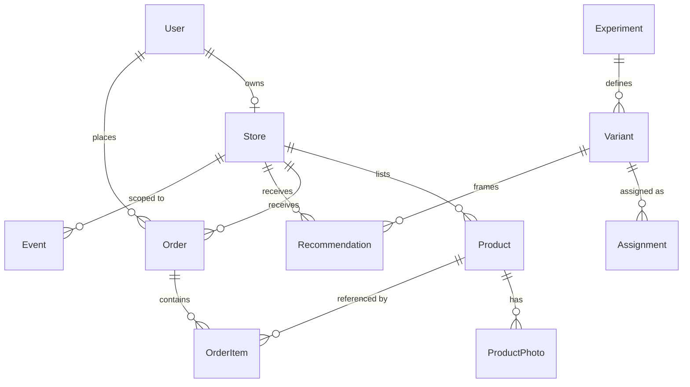

# Database schema

**Status:** draft
**Written:** 2026-08-28
**Engine:** PostgreSQL, accessed through Prisma in `packages/db`
**Related:** `architecture.md`, `api-spec.md`, `detailed-design.md`

The commerce tables can be reshaped later if they turn out wrong. The telemetry and research tables cannot: they hold a semester of collection that has no second copy and no way to be regenerated. `CLAUDE.md` requires the owner to be asked before `Event`, `Assignment` or `Recommendation` change shape, and nothing in this document changes their shape.

## Conventions

| Convention | Rule | Why |
|---|---|---|
| Primary keys | `cuid()` text | Safe to expose in a URL; no enumeration of how many stores exist |
| Money | Integer **satang**, never float | `฿12.30` is `1230`. Floating point money produces totals that do not add up, which sellers notice immediately |
| Timestamps | `timestamptz`, UTC in the database, Asia/Bangkok at the edges | A study measured in seven-day windows cannot afford ambiguous local time |
| Soft state | Explicit `status` enums, not booleans that accumulate | `is_published` plus `is_archived` plus `is_hidden` becomes unanswerable |
| `is_seed` | On **every** table, default `false` | Rule 6. Demo rows must be excludable from every query, everywhere |
| Deletes | Commerce rows may be deleted. Telemetry rows may not | See the append-only section |
| Naming | `snake_case` in the database, `camelCase` in Prisma client | Prisma maps between them; SQL in `analysis/` reads naturally |

## Entity overview



`Event` is drawn attached to `Store` only. It is deliberately not related to anything else with a foreign key — see below.

## Commerce tables

### User

| Column | Type | Constraints | Notes |
|---|---|---|---|
| `id` | text | PK | |
| `email` | citext | unique, not null | Personal data. Never in an event payload or a log line |
| `password_hash` | text | not null | Argon2id. Never logged, never returned by any endpoint |
| `role` | enum | `seller` \| `buyer` \| `admin` | A seller may also buy; role gates the dashboard, not the storefront |
| `display_name` | text | not null | Personal data |
| `created_at` | timestamptz | default now() | |
| `is_seed` | boolean | default false | |

Q-3 is unresolved: if buyers may check out as guests, `Order.buyer_id` becomes nullable and buyer-side events lose their actor. That is a schema consequence of a product question, which is why the question is answered before PB-14 rather than during it.

### Store

| Column | Type | Constraints | Notes |
|---|---|---|---|
| `id` | text | PK | |
| `owner_id` | text | FK → User, **unique** | One store per seller — enforced by the database, not by the UI |
| `name` | text | not null | |
| `slug` | text | unique, not null | Storefront URL |
| `description` | text | | |
| `category` | enum | | Also the peer group for any comparison framing |
| `contact_channel` | text | | Personal data. Shown to buyers, never in events |
| `status` | enum | `active` \| `paused` | A seller on exam week can pause without deleting |
| `created_at`, `updated_at` | timestamptz | | |
| `is_seed` | boolean | default false | |

### Product

| Column | Type | Constraints | Notes |
|---|---|---|---|
| `id` | text | PK | |
| `store_id` | text | FK → Store, indexed | |
| `name` | text | not null | |
| `description` | text | | |
| `price_satang` | integer | not null, ≥ 0 | |
| `stock` | integer | not null, ≥ 0 | |
| `status` | enum | `draft` \| `published` \| `unpublished` | Only `published` appears in the catalogue or counts toward photo coverage |
| `created_at`, `updated_at` | timestamptz | | |
| `is_seed` | boolean | default false | |

Index: `(store_id, status)` — every dashboard metric and every advisor trigger filters on exactly this pair.

### ProductPhoto

| Column | Type | Constraints | Notes |
|---|---|---|---|
| `id` | text | PK | |
| `product_id` | text | FK → Product, indexed, cascade delete | |
| `storage_key` | text | not null | Object storage key, not a public URL — the URL is built at read time so the bucket can move |
| `position` | integer | not null | Display order |
| `created_at` | timestamptz | | |
| `is_seed` | boolean | default false | |

This table is the source of the photo-coverage metric, which is the trigger for the first recommendation and the target of the primary metric. A photo row that exists without its `product.photo_added` event, or an event without its row, breaks the study — which is why both are written in one transaction.

### Order and OrderItem

| Column | Type | Constraints | Notes |
|---|---|---|---|
| `Order.id` | text | PK | |
| `Order.store_id` | text | FK → Store, indexed | One order belongs to exactly one store |
| `Order.buyer_id` | text | FK → User, indexed | Nullable only if Q-3 resolves to guest checkout |
| `Order.status` | enum | Q-5 | Placeholder: `placed` → `accepted` → `ready` → `completed`, plus `cancelled` |
| `Order.total_satang` | integer | not null | Sum of items at the time of ordering |
| `Order.placed_at` | timestamptz | not null | |
| `Order.is_seed` | boolean | default false | |
| `OrderItem.order_id` | text | FK → Order, cascade | |
| `OrderItem.product_id` | text | FK → Product, restrict | Restrict, not cascade — deleting a product must not erase order history |
| `OrderItem.quantity` | integer | ≥ 1 | |
| `OrderItem.unit_price_satang` | integer | not null | **Price at the time of ordering**, copied, not joined |
| `OrderItem.name_snapshot` | text | not null | The name the buyer actually saw |

The two snapshot columns exist for the same reason `Recommendation.metric_snapshot` does: a seller changing a price next week must not silently rewrite what last week's buyer agreed to.

## Telemetry table

### Event — append-only

| Column | Type | Constraints | Notes |
|---|---|---|---|
| `id` | text | PK | |
| `type` | text | not null, indexed | e.g. `product.photo_added`. Values come from the constant in `packages/shared` |
| `actor_type` | enum | `seller` \| `buyer` \| `system` | |
| `actor_id` | text | nullable | `null` for system events |
| `store_id` | text | nullable, indexed | The join key for the entire study |
| `entity_type` | text | nullable | e.g. `product` |
| `entity_id` | text | nullable | |
| `payload` | jsonb | not null, default `{}` | IDs and values only. **No names, phone numbers, addresses or email** |
| `occurred_at` | timestamptz | not null, indexed | |
| `is_seed` | boolean | default false | |

Indexes: `(store_id, type, occurred_at)` for the action-rate join, `(occurred_at)` for exports, `(type)` for counts.

**No foreign keys, by design.** An event is a historical fact. If a product is deleted, the event that a photo was added to it on 3 October remains true, and a cascade would erase it. `entity_id` is a reference, not a constraint.

**`type` is text, not a Postgres enum.** Event types are added continuously and a Postgres enum needs a migration for each addition, which invites batching them up and shipping a feature without its event. The valid set lives in `packages/shared`, is validated at the emit site, and is checked in the analysis.

Append-only is enforced in three places, described in `decisions/0001-append-only-event-store.md`: the application layer refuses, the database role has no `UPDATE` or `DELETE` grant on the table, and the code review checklist looks for it.

## Research tables

Shapes are exactly as specified in `CLAUDE.md`. Changing any of them requires asking the owner first.

### Experiment

`id`, `name`, `status` (`draft` \| `running` \| `stopped`), `unit` (`recommendation` \| `session` \| `store`), `started_at`, `stopped_at`, `is_seed`.

One row per experiment document in `docs/03-research/experiments/`. `name` carries the document ID, e.g. `EXP-001`, so a result can be traced back to the design that was written before the code.

### Variant

`id`, `experiment_id` (FK), `key` (`A`, `B`, …), `name`, `template` (text), `template_checksum` (text), `is_seed`.

Unique on (`experiment_id`, `key`).

`template` holds the Thai copy with placeholders filled from `metric_snapshot`. `template_checksum` is compared at start-up against the value recorded in the experiment document — if the text in the database has drifted from the text that was pre-registered, the application refuses to deliver rather than quietly running a different experiment (TS-01-14).

### Assignment

`id`, `experiment_id` (FK), `variant_id` (FK), `unit_type`, `unit_id`, `assigned_at`, `is_seed`.

**Unique on (`experiment_id`, `unit_type`, `unit_id`).** This constraint is the entire defence against re-randomisation. A concurrent second attempt loses the insert and reads the existing row (ALT-7, TS-01-03).

### Recommendation

`id`, `store_id` (FK, indexed), `action_type` (text), `variant_id` (FK), `metric_snapshot` (jsonb), `delivered_at` (timestamptz), `dismissed_at` (timestamptz, nullable), `created_at`, `is_seed`.

- `action_type` must resolve to at least one event type through the mapping in `packages/shared`. TS-01-08 asserts it for every registered recommendation type.
- `metric_snapshot` is written once, at generation, and never updated. TS-01-05 asserts it does not move when the store does.
- `delivered_at` starts the seven-day window. Its exact meaning is OQ-J1 and must be settled before PB-24.

Index: `(store_id, delivered_at)` — the shape of the analysis join.

## The primary metric, as SQL

This is the query the thesis rests on. It is written here so that the schema can be checked against it rather than the other way round.

```sql
SELECT v.key AS variant,
       COUNT(*) AS delivered,
       COUNT(*) FILTER (WHERE e.id IS NOT NULL) AS acted
FROM recommendation r
JOIN variant v ON v.id = r.variant_id
LEFT JOIN LATERAL (
  SELECT e.id
  FROM event e
  WHERE e.store_id = r.store_id
    AND e.type = ANY (:event_types_for_action)   -- from the action_type mapping
    AND e.occurred_at >  r.delivered_at
    AND e.occurred_at <= r.delivered_at + interval '7 days'
    AND e.is_seed = false
  LIMIT 1
) e ON true
WHERE r.delivered_at IS NOT NULL
  AND r.is_seed = false
GROUP BY v.key;
```

Exclusions from `docs/03-research/analysis-plan.md` — recommendations delivered within seven days of the study end, and stores with no published products at delivery time — are applied in `analysis/`, not here, so that the pre-registered plan stays the single description of them.

## Migrations

- One migration per change, generated by `pnpm db:migrate`, committed with the code that needs it.
- Every migration must run against an **empty** database, not only against the developer's current one. A migration that depends on local state fails on deployment, at the worst possible moment.
- No migration may `UPDATE` or `DELETE` rows in `event`, `assignment` or `recommendation`. If a migration seems to need it, that is the signal to stop and ask.
- Adding a column is safe. Renaming or dropping one on a research table is not, and is on the ask-before-doing list.

## Seed data

`pnpm db:seed` writes a small, believable store with products, photos, orders and events — every row `is_seed = true`. It exists so that the dashboard and the advisor can be developed without waiting for real sellers, and so that screenshots and demos never use a real person's data.

Two rules: seed rows are excluded from every analysis query and from every seller-facing metric (REQ-D3), and the seed script never creates rows in `experiment`, `variant` or `assignment` for a **running** experiment.
